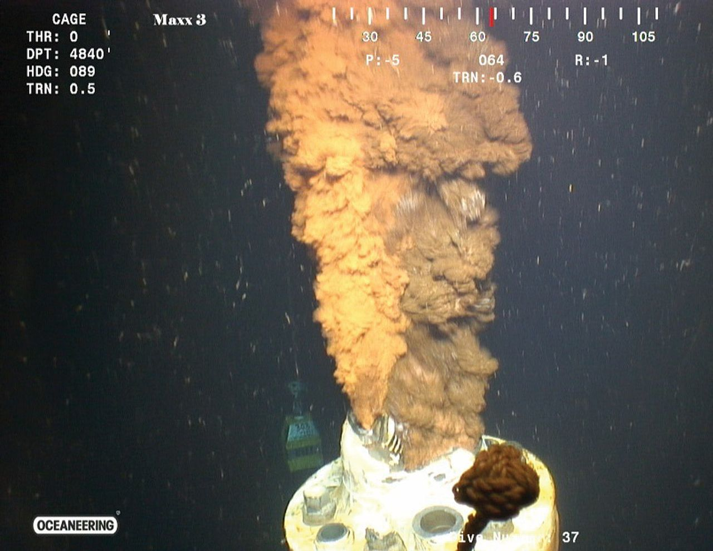

```{r setup, include=FALSE}
knitr::opts_chunk$set(echo = TRUE, warning = FALSE, message = FALSE, fig.height = 4, fig.width = 4, fig.align = "center")
```


```{r, echo=FALSE}
# required packages
library(mosaic)
library(mosaicCalc) # we are using beta version 0.5.7 
library(knitr)
library(kableExtra)
```


# Introduction

The emergence of multiple integrated fields such as computational biology, computational chemistry, computational geometry and computational physics in recent years is a testimony to the power of computation and the potential of its integration within classical STEM fields in order to solve more complex problems. The integration of computational thinking and modeling into STEM classrooms is relatively new. Computational thinking is understood as the thought process involved in formulating problems whose solutions can be expressed as computational steps or algorithms to be carried out by a computer, @lee2020, and computational modeling is the realization of such mathematical models through computation,  @calder. Many researchers argue for the inclusion of computational thinking and modeling in mathematics and science classrooms [@weintrop2016; @lee2020]. Some see such integration as a potential for students to build strong and mutually supportive relationship between mathematical knowledge and computational knowledge, @weintrop2016. It has been suggested that students who learn to engage with computational methods and tools will advance their understanding of mathematics and will gain awareness of current applications of computational thinking in mathematics and across STEM fields. Others insist that an integration of mathematics and computational thinking allows students to engage with real-world problems, authentic tools, and authentic mathematical practices, @bain2021. 

Although there has been progress in elucidating what integration of computational thinking and modeling and mathematics looks like in the classroom [@benakli2017; @bain2021], work in this area is still needed, from project design perspectives to the pedagogies that best address mathematical and computational knowledge and practices. While some mathematical problems lend themselves to computational approaches, problems often need to be reframed so that existing computational tools can be utilized. Strategies for doing this may include simplifying complex problems, reframing them into known problems, and decomposing problems into a sequence of sub-tasks. In this paper we present a computational modeling project designed for incorporation into existing undergraduate mathematics courses such as Calculus, Numerical Methods and Mathematical Modeling. The design of this project represents an attempt of bringing computational modeling into the undergraduate mathematics classrooms. It also demonstrates how computation and visualization can be used to engage students in modeling, using the high-level programming language R.


# Project-Based Computational Modeling

In this article, we describe a computational modeling project that explores the 2010 Deepwater Horizon oil spill in the Gulf of Mexico, considered the largest oil spill in the history of marine oil drilling. The objective is to use real data for the estimated flow rates over the 87-day oil spill to compute the total volume of oil spill. The idea is to use the flow rate data and create a continuous function of the flow rate as a function of time that interpolates the data linearly. Then the total volume of  oil spill is computed by numerically integrating the interpolated flow rate function over the full-time period. The project focuses on the computational and mathematical aspects of linear interpolation of data and numerical integration in addition to creating 2D-visualizations. It also aims at raising awareness of important social issues, which could be better understood with the use of mathematics.

This project can be used in a Calculus, Numerical Methods or Mathematical Modeling course or assigned as an independent project. We recommend the project to be introduced to students by scaffolding the mathematical ideas and coding procedures needed for them to work through the different steps of the project. Prior programming experience is not required, but in this case an introduction to basic scientific computing using a high-level programming language such as \textsf{R}, Python, Julia, or Matlab should be included. In this paper, we implement all computations and visualizations using \textsf{R} and R Markdown in RStudio, as well as a number of R packages, [@chambers;@rstudio;@allaire2021]. We suggest that students use the RStudio Cloud, @allaire2022, rather than installing \textsf{R}, RStudio and additional R packages on their computers.


# Technology Framework

We use R Markdown notebooks (@grolemund2021) in RStudio (@allaire2021) for all computations and visualizations with \textsf{R}. RStudio supports R Markdown documents through the `knitr` package. The first time one tries to create an R Markdown document in RStudio, one is prompted to install all required packages, including `rmarkdown`, `knitr` and `tinytex`. Once an R Markdown notebook is created, it can be knitted into a pdf or html output or a Word document, if MS Word is installed. Working with R Markdown documents allows one to unify plain text narrative, mathematical expressions typeset in \LaTeX\, as well as \textsf{R} and Python code (using the `reticulate` package, @ushey). Another advantage is that it creates fully reproducible, publication-quality project reports, presentations and papers. The following software installers are available for Windows, Mac and Linux:

- \textsf{R} installers: \url{https://cloud.r-project.org/}
- RStudio installers: \url{https://www.rstudio.com/}

A cloud-based option (free and paid) for computing with RStudio is provided by the RStudio Cloud (@allaire2022), which also offers an instructor's account for creating virtual classrooms. In 2022 RStudio Cloud released a new real-time collaboration feature for shared projects in the RStudio Cloud that is very much like working in Google Docs. However, it requires more RAM and CPU when there are more than two collaborators. RStudio also offers an \textsf{R} interface to Python via the `reticulate` \textsf{R} package, which provides a comprehensive set of tools for interoperability between Python and \textsf{R}, @ushey. Thus, one can use both \textsf{R} and Python chunks of code in the same R Markdown document, combining the power of both. With R Markdown, one can even create websites, blogs and books using the `blogdown` and `bookdown` packages; see the resources tab on the RStudio website, @allaire2021.  

Another useful cloud-based computing environment is CoCalc (@stein), which offers free and paid accounts for online computing using SageMath, \textsf{R}, Python, Julia, Octave, etc. CoCalc also offers document authoring using Jupyter Notebooks and \LaTeX\. 

In addition to base \textsf{R}, we use several R packages such as `mosaic`, `mosaicCalc` and `ggformula` [@pruim2017; @kaplan2020; @kaplan2021] developed by Project Mosaic (@kaplan), spearheaded by educators who strive to develop new approaches to teaching mathematics, statistics, computation and modeling.

At the time of writing, we used the developmental GitHub version 0.5.7 of the `mosaicCalc` package. Installing packages from GitHub is done using the `devtools` package. In particular, the beta version of the `mosaicCalc` package can be installed from its GitHub repository with the command below run in the RStudio Console: 

```{r, eval=FALSE, echo=TRUE}
devtools::install_github("ProjectMOSAIC/mosaicCalc", ref="beta")
```

The `mosaicCalc` package is designed to facilitate the use of R in Statistics and Calculus instruction by providing a number of functions that: (a) make many tasks fit into a template, and (b) simplify some tasks that would otherwise be too complicated for beginners.

We recommend the following resources to learn the basics of \textsf{R}: [@braun2021; @wickham2017; @cornelissen2022], and R Markdown: [@rstudio; @xie2022; @grolemund2021]. The reader can find additional resources on computational-problem solving with \textsf{R} in the following references [@kaplan2015; @jones2014; @benakli2017; @kostadinov2019]. 


# Computational Modeling Project: Estimating the Volume of the Deepwater Horizon Oil Spill


```{r oil, echo=FALSE,fig.align='center',out.width='38%',fig.cap="Oil and natural gas escaping from the riser tube after it was severed."}

```

On April 20, 2010, the oil drilling rig Deepwater Horizon in the Gulf of Mexico exploded and sank, resulting in the death of 11 workers and the largest oil spill in the history of marine oil drilling operations. Figure \ref{fig:oil} shows the flow of oil and natural gas leaking; see @mcnutt2012. Experts used pictures like this one to estimate the flow rate of the oil spill. 

The volume of the oil escaping the damaged well, originally estimated by BP (British Petroleum) to be about 1,000 barrels per day, was thought by U.S. government officials to have peaked at more than 60,000 barrels per day; see @britannica. It was estimated that around 4.9 million barrels of oil leaked from the damaged well over an 87-day period, before it was finally capped on July 15, 2010. The objective of this project is to address the following question: How much oil in total was leaked during the 87 days of the BP oil spill?

The government report from the US Department of the Interior, @mcnutt2012, provides data for the flow rates of the oil spill at 8 time points in units of barrels of oil per day. Our approach is to use this information displayed in Table \ref{tab:rates}.


```{r rates, echo=FALSE}
library(knitr)
key_days <- c(1,2,3,45,46,84,86,87)
flow_rates <-c(0,0,62000,57500,59800,55200,53000,0)
flow_data<-tibble(key_days,flow_rates)
kable(flow_data, col.names = c("day", "flow rate"), booktabs=TRUE, 
      caption = "Flow-rate estimates for the Deepwater Horizon oil spill.") |> 
  kable_styling(position = "center") |> 
  kable_styling(latex_options = "HOLD_position")
```


In preparation for the project, students may be assigned to do some  readings about the Deepwater Horizon oil spill, the slick that was formed and extended over 57,500 square miles (149,000 square kilometers) of the Gulf of Mexico, and its damaging effects on clean water, environment, wildlife and local industries like fishing and tourism; see @britannica, for instance. 

There were a number of reasons for needing to estimate the volume of the oil spill. For example, the planning for containment of the oil slick required a realistic assessment. Moreover, the amount of dispersants used to minimize the oil slick was proportional to the volume of the oil spill.


# Computing the Volume of the Deepwater Horizon Oil Spill

The key mathematical idea is to use the flow rates from Table \ref{tab:rates} and create a continuous  function of the flow rate in terms of time $t$, $\text{flow}(t)$, that interpolates the data piecewise linearly so that all data points are connected by line segments. The total volume of the oil spill during this 87-day period is given by the integral:

\begin{equation}
\text{Volume} = \int_1^{87} \text{flow}(t) dt. \label{eq:1}
\end{equation}


## Piecewise Linear Interpolation

The  *piecewise linear interpolation* consists of connecting the data points with straight lines. Let  $P_k=(x_k,y_k)$ represent a data point for $k=1,2,\ldots,n$, where we assume that the $x$-coordinates are arranged in increasing order. For our purposes, any two $x$-coordinates are different. The first question to answer is the following: What is the equation of the line connecting $P_k$ and $P_{k+1}$? The slope of this line is $\Delta_k=(y_{k+1} - y_k)/(x_{k+1}-x_k)$, also known as the *first divided difference* for the $k$th interval. The equation of the line passing through $P_k$ and $P_{k+1}$ is:

\begin{equation}
y = y_k + \Delta_k (x - x_k) = y_k + \frac{y_{k+1} - y_k}{x_{k+1}-x_k} (x - x_k) \label{eq:line}
\end{equation}

\noindent for $x \in [x_k,x_{k+1}]$. We can use \ref{eq:line} to construct the piecewise linear function connecting all data points, from $P_1$ through $P_n$. To do this, for any given $x$, we need to determine the interval index $k$ such  that $x \in [x_k,x_{k+1}]$, in the case $x$ falls inside the range of values for the $x$-coordinates of two data points. The other possibility is when $x$ falls outside the interval $[x_1,x_n]$. Then we need to consider the two boundary cases, namely, when $x$ is to the left or to the right of all $x$-coordinates for the given data points. Thus, we can define the interval index $k$ associated with a real number $x$ in the following way:
\[k=\begin{cases}1,&\text{ if } x< x_1, \\j,&\text{ if } x\in[x_j,x_{j+1}] \text{ with } 1\leq j \leq n-1,\\ n-1,&\text{ if } x> x_n.\end{cases}\]

For the purpose of the implementation, we let the variable `u` represent an arbitrary value of $x$, and the vectors `x` and `y` represent all $x$- and $y$-coordinates of the data points, respectively. The number of data points is $n=8$. 

```{r}
x <- c(1,2,3,45,46,84,86,87) # days
y <- c(0,0,62000,57500,59800,55200,53000,0) # flow rates
```


Suppose that  `u` is within the range of $x$-coordinates of the data points. We can determine the interval index $k$, which is represented in the code by `k` for the given value of `u`, by using the code `which(u<=x)[1]`. The `which()` function is a built-in function that returns the indices corresponding to `TRUE` values, so the code above returns the very first index `j` such that `u <= x[j]`, for the vector `x` of $x$-coordinates of the data points. This implies that $u\in [x_{j-1},x_j]$ so that the interval index of `u` is `k=j-1`. For example, let `u=2.5`. Then the interval index is `k=2`; see the code below. 

```{r}
u<-2.5
# very first index j s.t. u<=x[j]
j<-which(u<=x)[1] 
# interval index of u
k<-j-1 
```

On the other hand, if `u` is to the left of all $x$-coordinates, then the interval index `k` must be set to 1. Now, the code `which(u<=x)[1]` will return 1 since $u\leq x_1$, as we assume that all $x$-coordinates are arranged in increasing order. Thus, in this case the interval index is `k=j`, where `j=which(u<=x)[1]`. Finally, if `u` is to the right of all $x$-coordinates, then the interval index `k` must be set to `n-1`. Now, the code `which(u<=x)[1]` for `j` returns `NA` since $u > x_n$, i.e. there is no $x$-coordinate bigger than `u`. Thus, we have to use a condition to check if `j` is `NA`, and if `TRUE` then return the interval index `k=n-1`. 

We can put this logic together using the `ifelse()` construct. The code below returns the interval index `k` for any value of `u`. For example, for `u=88`, running the code below returns interval index `k=7`.  

```{r}
u<-88
n<-length(x)
j<-which(u<=x)[1]
k<-ifelse(is.na(j), n-1, ifelse(j==1, j, j-1))
```

We are now ready to define a function `lin_interp()` that returns the $y$ value represented by `L` in the code. This value comes from the equation of the line determined by the interval index of $x$. Note that we can compute the divided differences for all intervals at once using the code `diff(y)/diff(x)`, where `diff(y)` returns a vector of size $n-1$ with the consecutive differences between the $y$-coordinates, i.e. 

\begin{equation}
\texttt{diff(y)} = (y_2-y_1,y_3-y_2,\ldots,y_n-y_{n-1}).
\end{equation}

Keep in mind that all operations in R are vectorized, so the expression `diff(y)/diff(x)` returns a vector whose components are computed elementwise. The implementation of `lin_interp()` is given below: 

```{r}
lin_interp <- function(x, y, u) {
  delta <- diff(y) / diff(x)
  n <- length(x)
  j <- which(u <= x)[1]
  k <- ifelse(is.na(j), n - 1, ifelse(j == 1, j, j - 1))
  L <- y[k] + delta[k] * (u - x[k])
  return(L) }
```

We have our piecewise linear interpolation function, which works fine when one applies it to a single value `u`, but it does not work if one wants to apply it to a vector of input values. This is important because often, say when we plot the graphs of functions, we need to be able to apply a function to a vector of input values and get the corresponding vector of output values. There are several ways we can approach this problem. One way is to use the built-in base function `Vectorize()`, which can vectorize specific arguments of our user-defined function. This function is a wrapper to `mapply()` from the apply family of functions. 

```{r}
# vectorize the "u" argument of the function
lin_interp<-Vectorize(lin_interp, "u")
```


Another way to vectorize our function is to modify the function to handle input vectors `u` by using a `for loop` that goes through each element of the `u` vector and computes the corresponding interval index using the same logic as for a single value of `u`. We leave this as an exercise for the reader. We can test our vectorized function `lin_interp()` by plotting its graph over the data points by running the code below, where we use the plotting functions `gf_line()` and `gf_point()` from the `ggformula` package that comes with the `mosaic` R package. 


```{r, eval=FALSE, echo=FALSE}
# exercise for the reader
lin_interp <- function(x, y, u) {
  delta <- diff(y) / diff(x)
  n <- length(x)
  m <- length(u)
  k <- rep(1, m)
  L <- rep(0, m)
  for (i in 1:m) {
    j <- which(u[i] <= x)[1]
    k[i] <- ifelse(is.na(j), n - 1, ifelse(j == 1, j, j - 1))
    L[i] <- y[k[i]] + delta[k[i]] * (u[i] - x[k[i]])
  }
  return(L)
}
```


```{r lininterp, echo=TRUE, eval=FALSE, fig.height=2.5, fig.width=5, fig.align='center', fig.cap="Piecewise linear interpolation of the data points."}
u<-seq(1,87,by=0.1)
v<-lin_interp(x,y,u)
gf_line(v ~ u, col="blue", size=1, alpha=0.6) |> 
  gf_point(y ~ x, col="red", size=2)
```


There is a more sophisticated implementation of the piecewise linear interpolation given below, using a vectorized coding approach, and we challenge the reader to understand how the code below works. 

```{r, eval=FALSE, echo=TRUE}
# Exercise: tricky implementation of piecewise linear interpolation
lin_interp_v2 <- function(x,y,u){
      delta <- diff(y)/diff(x)
      n <- length(x)
      k <- rep(1, length(u))
      for(j in 2:(n-1)) k[x[j] <= u] <- j
      L <- y[k] + delta[k]*(u - x[k])
      return(L)
}
```


Yet another way to implement a piecewise linear interpolation is to use the `mosaic` R package. We can create a piecewise linear function $\text{flow}(t)$ for the flow rate by linearly interpolating the 8 data points, using the `connector()` function from the `mosaic` R package. First, we need to convert the given data points into a data frame using the `tibble()` function from the `dplyr` package, as shown in the code chunk below. 

```{r}
key_days <- c(1,2,3,45,46,84,86,87)
flow_rates <- c(0,0,62000,57500,59800,55200,53000,0)
flow_data <- tibble(key_days,flow_rates) # data frame
```

Next, we use the `connector()` function to create a piecewise linear function `flow()` from the flow rate data:

```{r}
flow<-connector(flow_rates ~ key_days, data=flow_data)
```

The `connector()` returns a function of time in days, named `flow`. This is the R function representing the continuous and piecewise linear function $\text{flow}(t)$ that connects the data points linearly. In Figure \ref{fig:ratesfun}, we visualize the flow rates data points within the given time window, and  plot the graph of the interpolating function $\text{flow}(t)$, which connects the data points linearly. Figure \ref{fig:ratesfun} was created with the code below, where we use the plotting function `slice_plot()` from the `mosaicCalc` package (beta version 0.5.7). 
  
```{r ratesfun, fig.height=2.5, fig.width=5, fig.align='center', fig.cap="The flow rates data points and the graph of the interpolating function."}
gf_point(flow_rates ~ key_days, data=flow_data, size=0.7, col="blue") |> 
slice_plot(flow(day) ~ day, domain(day=c(1,87)), 
           size=0.7, col="blue", alpha=0.5, n=1000) |>
  gf_labs(x = "day", y="flow rate [barrels of oil/day]") +
  theme(axis.text=element_text(size=7), axis.title=element_text(size=8))
```


## The Volume of the Oil Spill as the Integral of the Flow Rate

In order to compute the volume of the oil spill, we integrate the flow rate function. We compute the antiderivative function `volume()` of  $\text{flow}(t)$, using `antiD()` from the `mosaicCalc` R package.


```{r}
volume = antiD(flow(t) ~ t)
```

The code above implements the following integral: 
\begin{equation}
\text{volume}(t) = \int \text{flow}(t) dt.
\end{equation}

The `antiD()` takes $C=0$ as the  default value for the constant of integration. By the Fundamental Theorem of Calculus, the total volume of the oil spill is: 
\begin{equation}
\text{Vol} = \int_1^{87} \text{flow}(t) dt = \text{volume}(87) - \text{volume}(1) = `r volume(87) - volume(1)`,
\end{equation}

\noindent that is, `r format(volume(87) - volume(1), big.mark = ",", digits=2)` barrels of oil approximately. The report from the US Department of the Interior @mcnutt2012 gives an estimate of 4.9 million barrels of oil, with uncertainty of $\pm 10\%$, so our estimates are relatively close. 

In Figure \ref{fig:vol}, we visualize the volume of the oil spill in units of barrels of oil as a function of time. This figure was created with the code below. 

```{r vol, fig.height=2.3, fig.width=4.8, fig.align='center', fig.cap="The volume of the oil spill over time, in barrels of oil."}
slice_plot(volume(t) ~ t, domain(t=c(1,84)), col="blue", 
           size=0.6, n=1000, alpha=0.7) |> 
  gf_labs(x= "day", y = "volume of the oil spill") +
  theme(axis.text=element_text(size=7), axis.title=element_text(size=8))
```


Students can also be asked to compute the volume of the oil spill by hand, given the piecewise linear nature of the flow rate function. This could be a good additional exercise to supplement the computational modeling aspect of the project. 


# Conclusion

This article presents a project for engaging undergraduate students in mathematical modeling through the use of the high-level programming language \textsf{R}. It suggests that the inclusion of computational modeling as a core practice may address the challenges of teaching mathematics authentically using real-world contexts, as well as of helping students develop both technological and mathematical competencies. Computational modeling projects can offer many possibilities for connecting mathematics courses to social issues and other problems that affect society, thus giving real-world context to mathematics that everybody can relate to. 


# References
